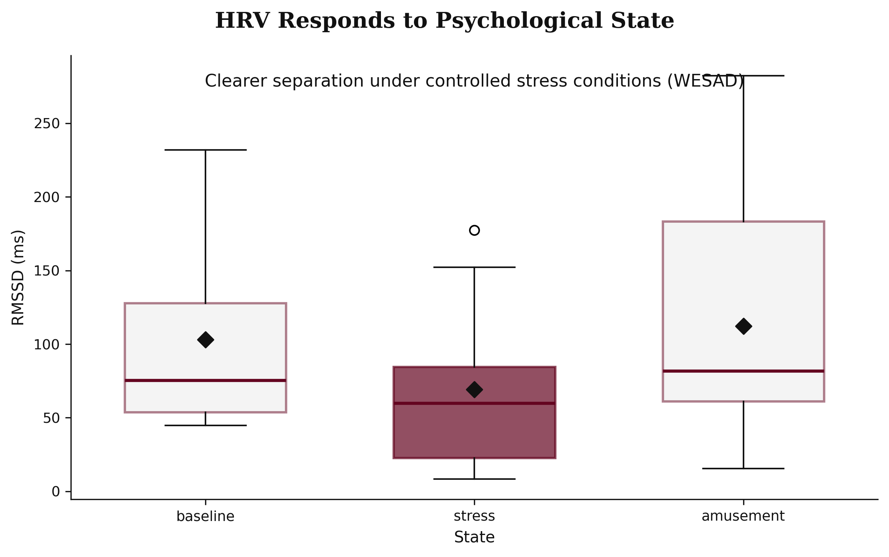
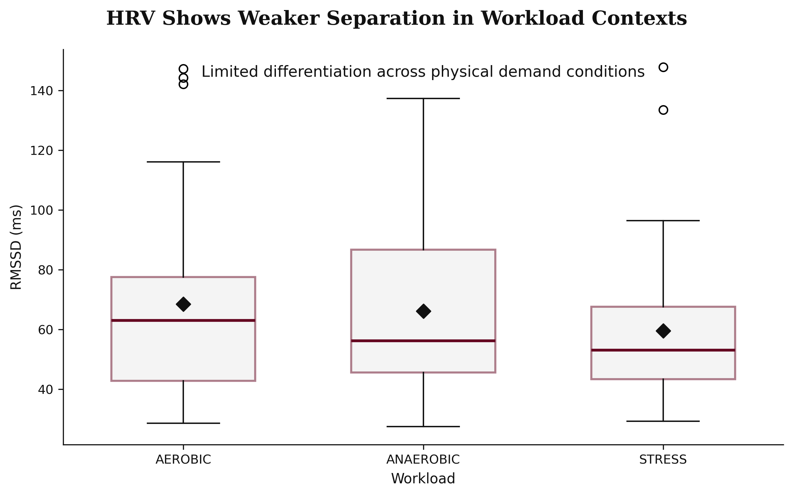
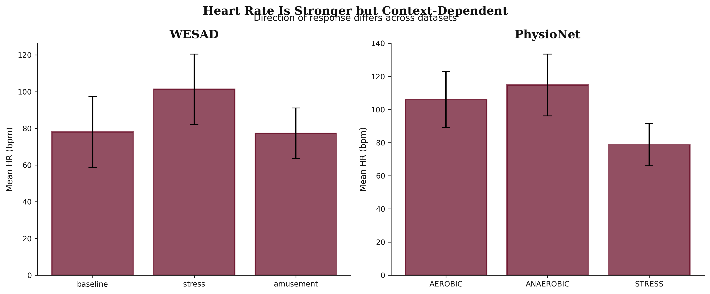
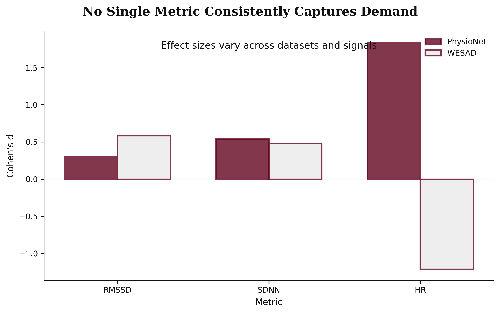

# Recovery vs Demand: Do Biological Signals Reflect Workload?

> A cross-dataset analysis of whether physiological signals capture workload and capacity.

## Overview

Most models of human capacity assume that biological signals—such as heart rate or heart rate variability (HRV)—can serve as reliable indicators of workload or performance.

This project tests that assumption across different physiological contexts.

- WESAD (controlled psychological stress)
- PhysioNet workload dataset (physical exercise vs. rest/recovery)

The analysis compares HRV and heart rate across contexts to evaluate whether these signals are consistent and reliable indicators of demand.

## Key Insight

**Physiological signals respond to demand, but neither HRV nor heart rate provides a consistent or context-independent measure of workload or capacity.**

## Why This Matters

Many wearable systems and productivity models rely on biological signals to infer human state, capacity, or performance. If these signals are inconsistent across contexts, they may not generalize from controlled settings to real-world applications. Understanding these limitations is critical for building reliable systems that depend on physiological measurements.

## Data

- **WESAD Dataset** (ECG-based HRV under psychological stress)
- **PhysioNet Wearable Dataset** (IBI-based HRV under physical workload)

**WESAD**: ECG signals collected during baseline, stress, and amusement conditions, representing controlled psychological states.

**PhysioNet**: Inter-beat interval (IBI) data collected during aerobic, anaerobic, and "STRESS" conditions. The two exercise conditions (aerobic, anaerobic) are the physical-demand contexts; the condition labeled "STRESS" in the source data is actually a low-demand rest/recovery state (its mean heart rate, ~79 bpm, is the *lowest* of the three, versus ~106–115 bpm during exercise), and is treated here as the recovery baseline rather than a demand condition.

## Methods

- HRV feature extraction (RMSSD, SDNN)
- Heart rate computation from IBI/ECG
- Group comparisons across states
- Statistical testing (t-tests / Mann-Whitney)
- Effect size analysis (Cohen's d)
- Cross-dataset comparison of directional consistency

## Key Findings

### 1. HRV Shows Moderate but Inconsistent Signal
- WESAD: clearer directional differences between baseline and stress
- PhysioNet: weaker and partially inconsistent patterns across workload conditions

### 2. Heart Rate Is Strong but Context-Dependent
- Large effect sizes in both datasets (Cohen's d > 1.0)
- Direction differs across contexts: HR increases under psychological stress (WESAD) but follows a different pattern under physical demand conditions (PhysioNet)

### 3. HRV Barely Separates Demand Conditions
- HRV shows at most weak separation between the rest/recovery condition and physical exertion (RMSSD: Cohen's d ≈ 0.24–0.30, not statistically significant; SDNN somewhat larger at d ≈ 0.52, only partially significant)
- It does **not** reliably distinguish between types of physical exertion (aerobic vs anaerobic: d ≈ 0.07)

### 4. No Single Metric Is Reliable Across Contexts
- HRV and HR both vary depending on environment and measurement conditions
- Effect sizes and directional patterns vary by dataset, indicating limited generalizability across contexts

## Visualizations

*HRV responds to psychological state. WESAD shows clearer separation under controlled stress conditions.*

*HRV shows weaker separation in workload contexts. Limited differentiation across physical demand conditions.*

*Heart rate is stronger but context-dependent. Direction of response differs across datasets.*

*No single metric consistently captures demand. Effect sizes vary across datasets and signals.*

## Interpretation

HRV reflects aspects of physiological state but is not stable across contexts. Heart rate is more sensitive to demand but lacks consistent interpretation—whether HR increases or decreases under stress depends on the type of demand (psychological vs physical). Biological signals capture different dimensions of demand depending on conditions, making it difficult to extract a single, generalizable measure of workload or capacity.

> These results highlight the gap between physiological measurement and practical modeling of human capacity.
>
> This reinforces that capacity is not a single measurable quantity, but an emergent property of multiple interacting systems.

## Limitations

- Small sample sizes (especially WESAD: 45 segments across subjects)
- Controlled vs real-world differences between datasets
- HRV sensitivity to preprocessing choices and segmentation parameters
- Lack of direct productivity or performance outcomes
- Different measurement modalities (ECG vs IBI) between datasets

## Implications

Biological signals alone are insufficient for modeling human capacity. Systems relying on single biomarkers may be unreliable or fail to generalize across contexts. Capacity likely emerges from multiple interacting signals rather than one variable, and context plays a critical role in shaping physiological responses.

## Next Step

> These findings support the need for simulation-based models that integrate multiple interacting behavioral and physiological factors rather than relying on single-variable explanations.
